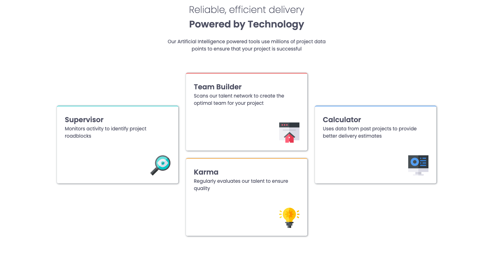

# Frontend Mentor - Four card feature section solution

This is a solution to the [Four card feature section challenge on Frontend Mentor](https://www.frontendmentor.io/challenges/four-card-feature-section-weK1eFYK). Frontend Mentor challenges help you improve your coding skills by building realistic projects.

## Table of contents

- [Overview](#overview)
  - [The challenge](#the-challenge)
  - [Screenshot](#screenshot)
  - [Links](#links)
- [My process](#my-process)
  - [Built with](#built-with)
  - [What I learned](#what-i-learned)
- [Author](#author)

## Overview

### The challenge

Users should be able to:

- View the optimal layout for the site depending on their device's screen size

### Screenshot

### Links

- Solution URL: [https://github.com/lawlawson/four-card-feature-section](https://github.com/lawlawson/four-card-feature-section)
- Live Site URL: [https://four-card-feature-selection.netlify.app/](https://four-card-feature-selection.netlify.app/)

## My process

### Built with

- Semantic HTML5 markup
- CSS custom properties
- CSS Grid
- Mobile-first workflow

### What I learned

This was a HTML & CSS project with a particular focusing on responsiveness. I decided to use CSS Grid to implement the layout of the boxes, particularly the change between tablet and larger screen sizes. The change in layout between the larger sizes was the most challenging aspect and required some research to implement a working solution as from the designs.

## Author

- Website - [https://lawlawson.dev/](https://lawlawson.dev/)
- Frontend Mentor - [@lawlawson](https://www.frontendmentor.io/profile/lawlawson)
- Twitter - [@lawsoncodes](https://www.twitter.com/lawsoncodes)
